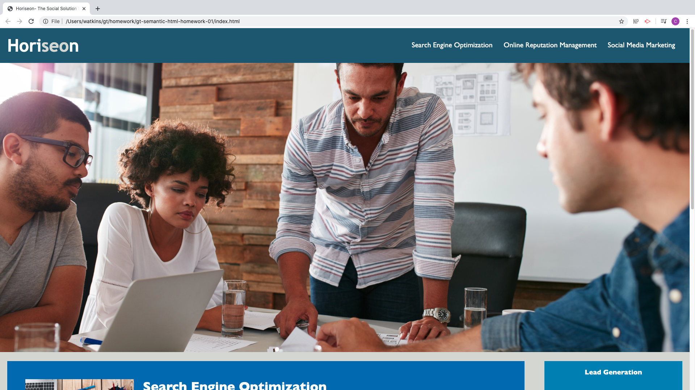
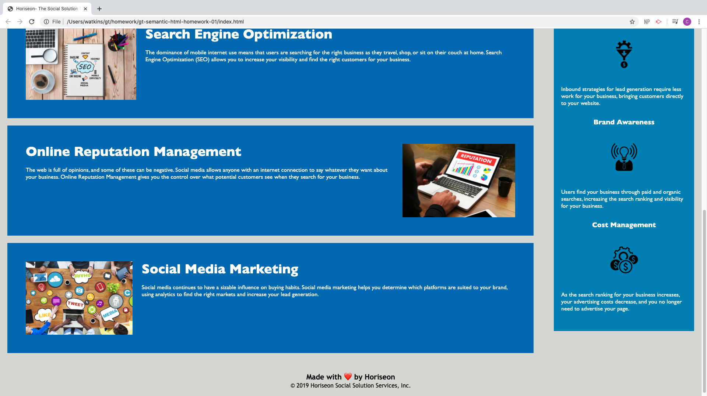

# Code Refactor Homework 1

## Description 

This is a homework requirement for GT Full Stack Flex Program. This webpage was built using HTML and CSS that needs to be refactored. The webpage now includes web accessibility, semantic elements, and has improved search engine optimization.

## Table of Contents

* [Installation](#installation)
* [Usage](#usage)
* [Credits](#credits)
* [MIT License](#mit_license)

## Installation

1. Clone the repo
2. Open the index.html file

[Link to Code](https://github.com/CrystalWatkins/gt-semantic-html-homework-01).
 
[Website link for Horiseon](https://crystalwatkins.github.io/gt-semantic-html-homework-01/).

## Usage 

This simple HTML file uses best practices for accessibility in programming.

[Link to Code](https://github.com/CrystalWatkins/gt-semantic-html-homework-01).
 
[Website link for Horiseon](https://crystalwatkins.github.io/gt-semantic-html-homework-01/).

## Credits

This was a code refactoring project completed as a homework for the Georgia Tech, FullStack Flex Program.

## MIT_License

Copyright (c) [2020] [Crystal Watkins]

Permission is hereby granted, free of charge, to any person obtaining a copy
of this software and associated documentation files (the "Software"), to deal
in the Software without restriction, including without limitation the rights
to use, copy, modify, merge, publish, distribute, sublicense, and/or sell
copies of the Software, and to permit persons to whom the Software is
furnished to do so, subject to the following conditions:

The above copyright notice and this permission notice shall be included in all
copies or substantial portions of the Software.

THE SOFTWARE IS PROVIDED "AS IS", WITHOUT WARRANTY OF ANY KIND, EXPRESS OR
IMPLIED, INCLUDING BUT NOT LIMITED TO THE WARRANTIES OF MERCHANTABILITY,
FITNESS FOR A PARTICULAR PURPOSE AND NONINFRINGEMENT. IN NO EVENT SHALL THE
AUTHORS OR COPYRIGHT HOLDERS BE LIABLE FOR ANY CLAIM, DAMAGES OR OTHER
LIABILITY, WHETHER IN AN ACTION OF CONTRACT, TORT OR OTHERWISE, ARISING FROM,
OUT OF OR IN CONNECTION WITH THE SOFTWARE OR THE USE OR OTHER DEALINGS IN THE
SOFTWARE.

---

🏆 The sections listed above are the minimum for a good README, but your project will 
ultimately determine the content of this document. You might also want to consider adding 
the following sections.

## Badges

## Contributing

Not currently taking any additional contributions at this time.

## Tests

There is no test needed for this project. 

